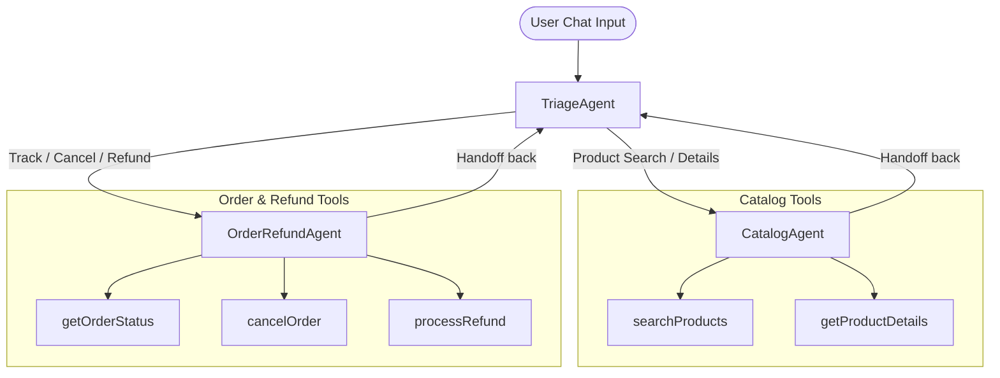

# 🤖 AI-Powered Customer Service Agent System

A modern, full-stack, multi-agent customer support application. The system leverages OpenAI's experimental `@openai/agents` SDK on the backend to orchestrate a team of specialized AI agents, paired with a dynamic React + TypeScript + Vite frontend dashboard.

This workspace contains two main projects:
1. **`backend_clientagents`**: An Express server running TypeScript that manages conversational session history and coordinates the multi-agent handoff loop.
2. **`frontend_react`**: A React application featuring a split-pane interface: a live mock database viewer on the left and an interactive support chat panel on the right.

---

## 🏗️ System Architecture & Agent Handoff Flow

The application implements a **Triage & Routing Pattern**. Instead of using a single general-purpose agent, the request is first analyzed by a triage specialist and routed to the agent best suited for the user's specific intent.



### The Specialist Team
*   **`TriageAgent` (The Director)**:
    *   **Role**: Greets users, answers basic questions, and directs traffic.
    *   **Handoff Logic**: Dynamically passes the conversation to the `CatalogAgent` for product inquiries or to the `OrderRefundAgent` for order-related tasks.
*   **`CatalogAgent` (The Inventory Expert)**:
    *   **Role**: Specialized in searching products, comparing specifications, and checking stock levels.
    *   **Tools**: `searchProducts`, `getProductDetails`.
*   **`OrderRefundAgent` (The Logistics Specialist)**:
    *   **Role**: Manages order tracking, cancellations, and refund processing.
    *   **Validation**: **Strictly** requires the customer to provide both their **Order ID** (e.g., `ORD-1001`) and **Email Address** before performing any operations.
    *   **Tools**: `getOrderStatus`, `cancelOrder`, `processRefund`.

---

## 🌟 Key Features

*   **Split-Pane Dashboard**:
    *   **Left Panel**: Real-time view into the Mock Database (Inventory & Orders). When an agent cancels or refunds an order, the status updates instantly in the dashboard view.
    *   **Right Panel**: Interactive chat interface with message history, typing indicators, and detailed tool execution logs.
*   **Dynamic Visual Theme (Agent Glow)**:
    *   The interface changes color based on which agent is currently active:
        *   🔵 **Blue glow**: `TriageAgent` is speaking.
        *   🟢 **Green glow**: `CatalogAgent` is speaking.
        *   🟣 **Purple glow**: `OrderRefundAgent` is speaking.
*   **Tool Execution Feeds**:
    *   The chat window renders intermediate tool calls (with input arguments) and tool outputs (prettified JSON logs) so users and developers can trace agent decision-making.
*   **Session Persistence**:
    *   Stores a unique `sessionId` in the browser's `localStorage` to preserve conversation history across page refreshes.

---

## 📂 Project Structure

```text
CustomerSeviceAIAgent/
├── backend_clientagents/       # Express + TypeScript Backend
│   ├── src/
│   │   ├── agents.ts           # OpenAI Agents and Zod tool definitions
│   │   ├── data.ts             # Mock Database (Products & Orders list)
│   │   ├── index.ts            # Express server & API endpoint router
│   │   └── test.ts             # Local test script for SDK verification
│   ├── .env.example            # Environment variables template
│   ├── tsconfig.json           # TS compile configurations
│   └── package.json            # Node backend dependencies
│
├── frontend_react/             # React + Vite + TypeScript Frontend
│   ├── src/
│   │   ├── assets/             # Static assets
│   │   ├── App.tsx             # Main dashboard UI component and chat loop
│   │   ├── App.css             # Theme, animations, and custom styling
│   │   ├── index.css           # Global resets and CSS variables
│   │   └── main.tsx            # React application entry point
│   ├── index.html              # HTML shell
│   ├── vite.config.ts          # Vite configuration
│   └── package.json            # Frontend package details
│
└── .gitignore                  # Root git ignore (excludes env, node_modules, build output)
```

---

## 🚀 Getting Started

### Prerequisites
Make sure you have [Node.js](https://nodejs.org/) (v18+ recommended) and `npm` installed.

---

### Step 1: Set Up and Run the Backend

1.  Navigate to the backend directory:
    ```bash
    cd backend_clientagents
    ```
2.  Install dependencies:
    ```bash
    npm install
    ```
3.  Set up environment variables:
    *   Duplicate `.env.example` and rename it to `.env`:
        ```bash
        cp .env.example .env
        ```
    *   Open `.env` and fill in your OpenAI API Key:
        ```env
        OPENAI_API_KEY=your-actual-api-key-here
        PORT=5000
        ```
4.  Start the backend server:
    *   **Development mode** (with auto-reload):
        ```bash
        npm run dev
        ```
    *   **Production build**:
        ```bash
        npm run build
        npm start
        ```
    The server will run on **`http://localhost:5000`**.

---

### Step 2: Set Up and Run the Frontend

1.  Open a new terminal window and navigate to the frontend directory:
    ```bash
    cd frontend_react
    ```
2.  Install dependencies:
    ```bash
    npm install
    ```
3.  Start the Vite dev server:
    ```bash
    npm run dev
    ```
4.  Open your browser and navigate to the address shown (usually **`http://localhost:5173`**).

---

## 🛠️ Testing the SDK Setup

If you want to verify that your OpenAI API key and the `@openai/agents` SDK work independently of the web server and UI, run the verification script:

```bash
cd backend_clientagents
# Make sure ts-node is installed (or run it via typescript compiler)
npm run dev src/test.ts
```

This runs a short command-line dialogue verifying the agent's memory and connection to OpenAI.

---

## 💾 Mock Database Data Reference

To test agent actions, you can use the following mock records:

### 📦 Product Catalog
*   `PROD-001`: Apex Wireless Headphones ($129.99, Category: Electronics)
*   `PROD-002`: Summit Tech Backpack ($89.99, Category: Accessories)
*   `PROD-003`: VoltCharge 20K Power Bank ($49.99, Category: Electronics)
*   `PROD-004`: Nebula Smart Projector ($349.99, Category: Electronics)
*   `PROD-005`: Quantum Mechanical Keyboard ($119.99, Category: Electronics)
*   `PROD-006`: HydroFlow Insulated Bottle ($34.99, Category: Kitchen & Home)
*   `PROD-007`: Aura Smart Lamp ($59.99, Category: Kitchen & Home)

### 🧾 Customer Orders
*   **Order ID:** `ORD-1001`
    *   **Email:** `customer@example.com`
    *   **Items:** Apex Headphones x1, VoltCharge Power Bank x1
    *   **Status:** `Processing` (Eligible for cancellation & refund)
*   **Order ID:** `ORD-1002`
    *   **Email:** `alice@company.com`
    *   **Items:** Summit Tech Backpack x1
    *   **Status:** `Shipped` (Cannot be cancelled, refund requires delivery)
*   **Order ID:** `ORD-1003`
    *   **Email:** `bob@gmail.com`
    *   **Items:** HydroFlow Insulated Bottle x2
    *   **Status:** `Delivered` (Eligible for refund processing)

---

## 🔌 API Endpoints Reference

The backend Express app exposes these HTTP JSON endpoints:

*   **`POST /api/chat`**
    *   **Body**: `{ sessionId: string, message: string }`
    *   **Description**: Sends message, processes handoffs/tools, returns AI answer, active agent name, and complete history.
*   **`POST /api/chat/reset`**
    *   **Body**: `{ sessionId: string }`
    *   **Description**: Clears session memory on the backend.
*   **`GET /api/products`**
    *   **Description**: Fetches list of all products in inventory.
*   **`GET /api/orders`**
    *   **Description**: Fetches list of all customer orders.
